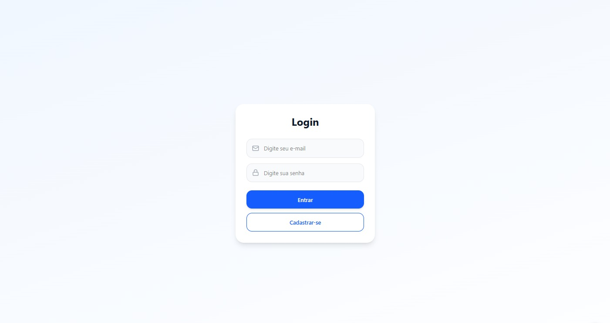
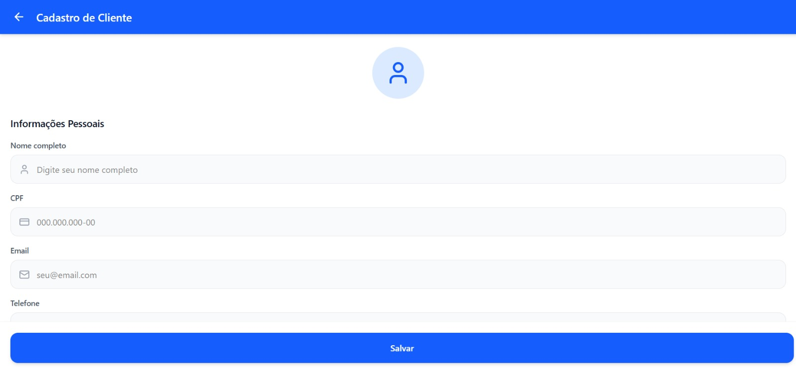
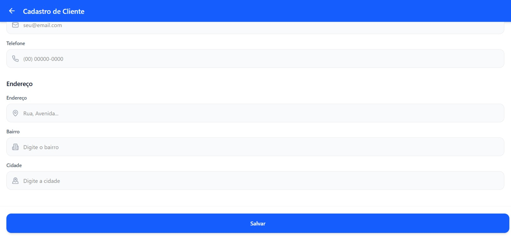
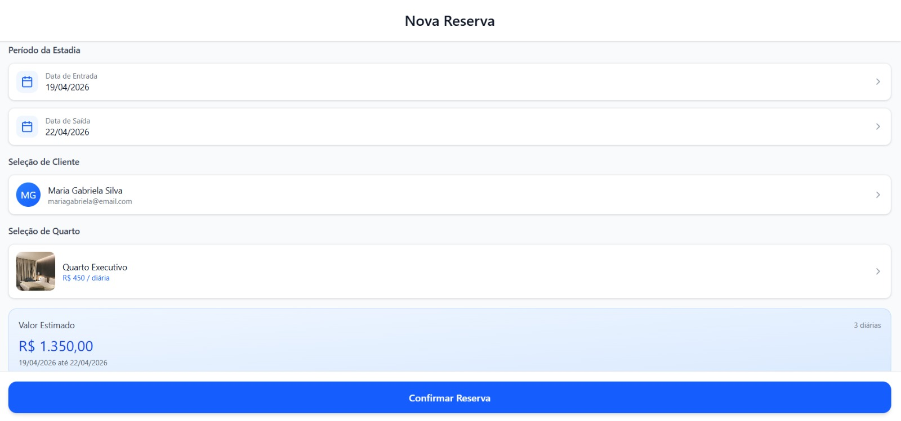
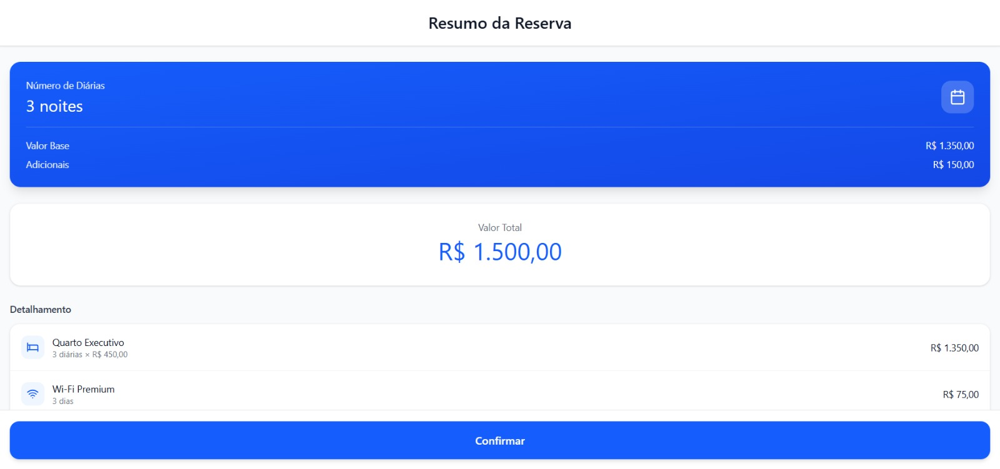
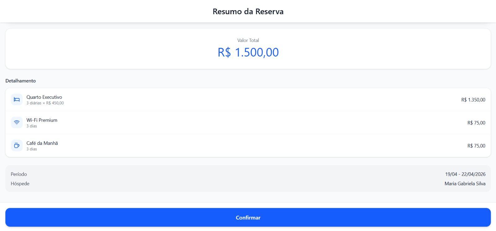

# Protótipos de Telas

Este documento apresenta os protótipos de interface do sistema de hospedagem desenvolvidos na Sprint 1.  
As telas representam o fluxo principal do sistema, sem implementação de funcionalidades.

---

## Tela de Login

  

Tela responsável pela autenticação do usuário no sistema.

---

## Cadastro de Cliente

  
  

Tela utilizada para o cadastro de novos clientes, contendo informações pessoais e endereço.

---

## Cadastro de Residência

  

Tela destinada ao cadastro de residências disponíveis para hospedagem.

---

## Cadastro de Quarto

  

Tela para cadastro de quartos, incluindo tipo, valor da diária e adicionais.

---

## Listagem de Quartos

  

Tela que apresenta os quartos disponíveis para reserva.

---

## Realização de Reserva

  

Tela onde o usuário seleciona datas e realiza a reserva.

---

## Resumo da Reserva

  
  

Tela que exibe o cálculo das diárias e o valor total da reserva.

---

## Recibo

  

Tela que apresenta o comprovante do pagamento da hospedagem.

---

## Histórico de Hospedagens

  

Tela que exibe o histórico de reservas realizadas pelo sistema.
